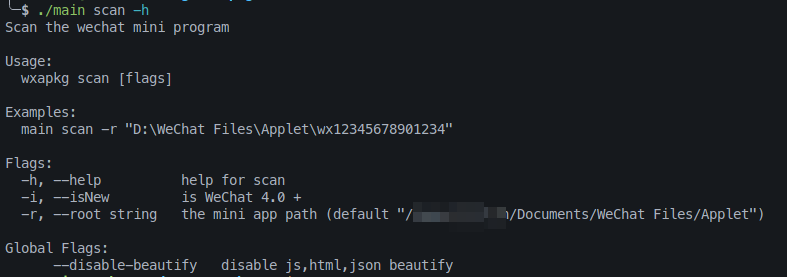

# wxapkg

> **免责声明**：此工具仅限于学习和研究软件内含的设计思想和原理，用户承担因使用此工具而导致的所有法律和相关责任！作者不承担任何法律责任！

## 📝 功能

- [x] 获取小程序信息（需要网络连接）
- [x] 代码美化，默认开启，可以使用 `--disable-beautify` 参数禁用
    - [x] 美化 `JSON` 文件
    - [x] 美化 `JavaScript` 文件（会有点慢）
    - [x] 美化 `Html` 文件，包括其中的 `<script>` 标签（会有点慢）
- [ ] 解析并还原成小程序原始源码文件结构 [#6](https://github.com/wux1an/wxapkg/issues/6)
- [ ] 自动导出文件中的敏感 url 和 key 等信息

## 🎨 用法


一般用法如下，目前**只支持 windows 系统**：

1. 用 PC 版微信打开小程序来让微信下载小程序  
2. 使用 `wxapkg.exe scan` 命令来扫描所有小程序。需要**联网**获取小程序的名称、路径、wxid（用于后续解密）等信息  
3. 使用键盘上下键选中想要处理的小程序，然后按回车来执行解密+解包  

如果想手动来解密指定小程序，可以使用 `wxapkg.exe unpack` 命令，需要指定小程序 wxapkg 文件路径，同时指定小程序的 `wxid`。如果没指定 `wxid`，会自动从路径中使用正则表达式匹配获取

支持Wechat4.0.0  
使用方法:

主要添加isNew参数来判断是否为新版本微信，新版本微信小程序存储路径为：
```
C:\Users\{用户名}\AppData\Roaming\Tencent\xwechat\radium\Applet\packages
```
使用方法为：
`wxapkg.exe scan -r "C:\Users\{用户名}\AppData\Roaming\Tencent\xwechat\radium\Applet\packages" -i true`
## ⚒️ 安装

下载最新的发布版本 [release](https://github.com/wux1an/wxapkg/releases/latest)，或者用下面的命令自己编译

```
go install github.com/wux1an/wxapkg@latest
```

## 🔗 参考

- 小程序解密: https://github.com/BlackTrace/pc_wxapkg_decrypt
- 小程序解包: [https://gist.github.com/Integ/bcac5c21de5ea3...](https://gist.github.com/Integ/bcac5c21de5ea35b63b3db2c725f07ad)
- 原理介绍: [https://misakikata.github.io/2021/03/%E5%BE%...](https://misakikata.github.io/2021/03/%E5%BE%AE%E4%BF%A1%E5%B0%8F%E7%A8%8B%E5%BA%8F%E8%A7%A3%E5%8C%85/)
- 终端 ui 库: https://github.com/charmbracelet/bubbletea
